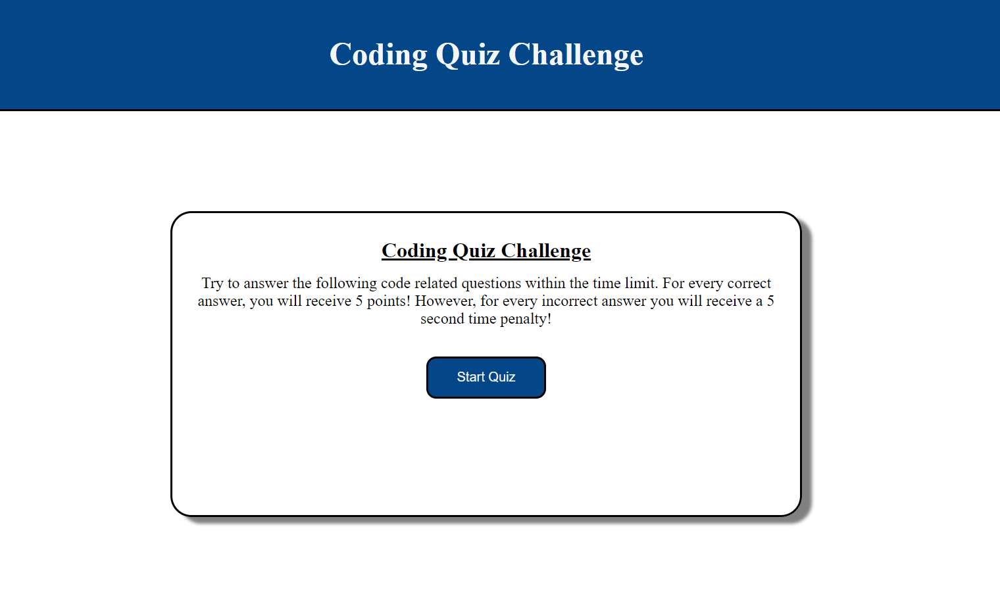

# Coding Quiz Challenge

## Description
This is a coding quiz challenge.
The purpose of this challenge was to take the skills we've learned recently in JavaScript and Web API's and apply them to a challenge of building a quiz.
In this challenge, we utilized skills that we have learned such as:
-creating variables
-creating and declaring functions
-creating elements using Javascript 
-adding event listeners
-using a for loop
-conditional statements
-appending 
-storing values to the local storage

## Table of Contents (Optional)
N/A

## Installation
N/A


## Usage
Instructions on how to use:
- Select start quiz
- When presented with a question, select the answer you think is right
- When quiz is over, either the time has run out, or you have completed all of the questions, you will see your final score and be given the opportunity to enter your initials
- When you see the box to enter your initials, enter your initials and select submit
- to see where you initials and score are being stored open up chrome dev tools and go to applications and look in the local storage folder.

```md

```

## Credits
Credit to our instructor, students in the class, TA's, tutor, and AskBCS.

Also to documentation
https://www.w3schools.com/
https://developer.mozilla.org/en-US/
https://www.youtube.com/


## License
[](https://opensource.org/licenses/MIT)


---

## Link to deployed site

<!-- come back and update link when you have it -->
